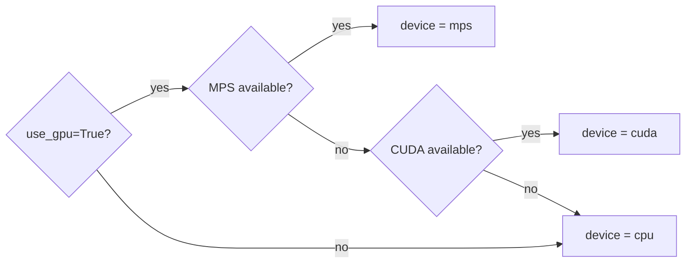
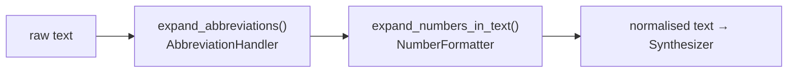

# Adapters

Adapters are the **only place where external frameworks live**. Each adapter implements one port Protocol and lives in its own directory under `src/tts_v2/adapters/`.

---

## Adapters catalog

| Adapter | Port | Module | When to use |
|---------|------|--------|-------------|
| `CoquiSynthesizerAdapter` | `SynthesizerPort` | `adapters/synthesizer/coqui_adapter.py` | Production: Coqui VITS (offline, local `.pth` weights) |
| `MockSynthesizerAdapter` | `SynthesizerPort` | `adapters/synthesizer/mock_adapter.py` | Tests, CI — returns silence, no GPU |
| `PassthroughVocoderAdapter` | `VocoderPort` | `adapters/vocoder/passthrough_adapter.py` | Production (end-to-end synthesis, no separate mel→wav step) |
| `BFSINormalizerAdapter` | `NormalizerPort` | `adapters/normalizer/bfsi_normalizer_adapter.py` | Production: chains BFSI abbreviation + number expansion |
| `FileSinkAdapter` | `AudioSinkPort` | `adapters/audio_sink/file_sink_adapter.py` | Write `.wav` to disk |
| `NoOpAuditAdapter` | `AuditPort` | `adapters/audit/noop_audit_adapter.py` | Tests, development — swallows all audit events |
| `FileAuditAdapter` | `AuditPort` | `adapters/audit/file_audit_adapter.py` | Production: JSONL audit log |

---

## CoquiSynthesizerAdapter

**Coqui VITS** end-to-end TTS. Returns `AudioChunk` with float32 samples at 22050 Hz.

```python
from tts_v2.adapters.synthesizer.coqui_adapter import CoquiSynthesizerAdapter

adapter = CoquiSynthesizerAdapter(
    model_name="tts_models/en/vctk/vits",
    use_gpu=True,   # resolves: MPS → CUDA → CPU
)
```

!!! warning "Model download on first use"
    Coqui downloads `~250 MB` of weights on the first call. They are cached in `~/.local/share/tts/`.

**Device resolution** (from `shared.device_utils`):



---

## MockSynthesizerAdapter

Returns **1 second of float32 silence** at 22050 Hz. No torch ops, no model loading. Used exclusively in tests.

```python
# From conftest.py:
mock_service = TTSService(
    synthesizer=MockSynthesizerAdapter(),
    normalizer=BFSINormalizerAdapter(),
    audio_sink=NullSinkAdapter(),
    audit=NoOpAuditAdapter(),
)
```

---

## BFSINormalizerAdapter

Chains two normalisation passes in order:



**Examples:**

| Input | Output |
|-------|--------|
| `"OTP is 482916"` | `"OTP is four eight two nine one six"` |
| `"EMI of ₹12,500"` | `"EMI of twelve thousand five hundred rupees"` |
| `"Please call KYC dept"` | `"Please call Know Your Customer department"` |

---

## FileSinkAdapter

Writes a `.wav` file using `soundfile` (via `shared.audio_utils.save_wav()`). Returns the resolved absolute path.

```python
sink = FileSinkAdapter(default_dir="outputs/")
path = sink.write(chunk, "alerts/otp_notice.wav")
# → "/Users/.../local_tts_v2/outputs/alerts/otp_notice.wav"
```

---

## FileAuditAdapter

Appends JSONL records to a log file. Each record:

```json
{
  "timestamp": "2026-02-23T13:00:00.000Z",
  "text_length": 52,
  "persona": "professional_male",
  "duration_s": 3.21,
  "rtf": 0.18,
  "output_path": "/path/to/otp_alert.wav"
}
```

```python
audit = FileAuditAdapter("logs/synthesis_audit.jsonl")
```

!!! tip "DPDPA compliance note"
    The `text` field itself is **not** logged — only `text_length`. This avoids storing PII (account numbers, OTPs) in the audit trail.

---

## Planned adapters

| Adapter | Status | Notes |
|---------|--------|-------|
| `F5SynthesizerAdapter` | Planned | F5-TTS (expressive, emotion control) |
| `FishSpeechAdapter` | Planned | Hindi/English code-switching |
| `RedisAuditAdapter` | Planned | Distributed audit for multi-instance deployments |
| `S3SinkAdapter` | Planned | Write `.wav` directly to S3/MinIO |
