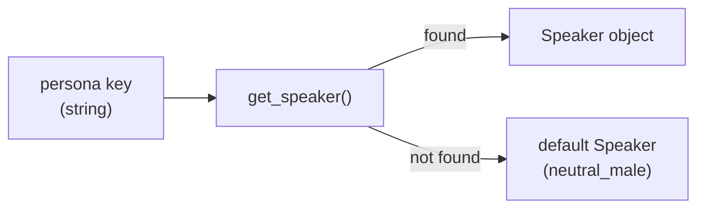

# Domain Layer

The domain layer contains **pure Python business knowledge** — no `torch`, no Coqui, no `soundfile`. It is safe to import anywhere, including CI environments with no GPU.

---

## voice.py — Speaker identities

### `Speaker` value object

```python
@dataclass(frozen=True)
class Speaker:
    persona:     str   # "professional_male"
    speaker_id:  str   # backend-specific, e.g. VCTK "p225" for Coqui
    agent_name:  str   # human-readable
    description: str   # compliance / usage guidance
```

`Speaker` is **frozen** (immutable, hashable). The `speaker_id` is the *only* field that changes when you swap TTS backends. All other code in the service layer uses `persona` as the stable key.

### BFSI agent registry

```python
AGENT_REGISTRY: Dict[str, Speaker] = {
    "professional_male":   Speaker(persona="professional_male",  speaker_id="p225", ...),
    "friendly_female":     Speaker(persona="friendly_female",    speaker_id="p226", ...),
    "neutral_male":        Speaker(persona="neutral_male",       speaker_id="p227", ...),
    "professional_female": Speaker(persona="professional_female",speaker_id="p228", ...),
}
DEFAULT_PERSONA = "neutral_male"
```

`get_speaker(persona)` looks up the registry and **falls back to `DEFAULT_PERSONA`** rather than raising — this prevents a misconfigured persona string from crashing production calls.



### Extending the registry

See [Adding a BFSI Persona](../guides/adding-a-persona.md).

---

## audio.py — Audio value objects

### `AudioChunk`

Represents a completed audio segment returned by the synthesizer.

```python
@dataclass
class AudioChunk:
    samples:     np.ndarray   # float32, mono
    sample_rate: int           # Hz, typically 22050 or 24000
    speaker_id:  str           # backend speaker_id used

    @property
    def duration_s(self) -> float: ...   # len(samples) / sample_rate

    def to_pcm_bytes(self) -> bytes: ... # int16 PCM for telephony
```

### `SynthesisRequest`

Passed from `TTSService` → `SynthesizerPort.synthesize()`.

```python
@dataclass(frozen=True)
class SynthesisRequest:
    text:     str              # Already normalised by NormalizerPort
    persona:  str              # e.g. "professional_male"
    metadata: dict             # Arbitrary pass-through (call_id, session_id, etc.)
```

`metadata` uses `field(default_factory=dict)` because frozen dataclasses cannot have a mutable default value.

### `SynthesisResult`

Returned by `TTSService.speak()` to the caller.

```python
@dataclass
class SynthesisResult:
    audio_chunk:  Optional[AudioChunk]  # None if output_path was provided
    output_path:  Optional[str]         # Resolved absolute path, or None
    rtf:          float                 # Real-Time Factor (synthesis_time / audio_duration)
    duration_s:   float                 # Audio duration in seconds
```

!!! info "Why `audio_chunk` XOR `output_path`?"
    When `output_path` is provided to `speak()`, the chunk has been written to disk and is discarded from memory — no double-buffering. When `output_path` is `None`, the raw numpy array is returned for streaming or further processing.

---

## Domain invariants

| Invariant | Enforced by |
|-----------|-------------|
| `AudioChunk.samples` is always float32 | `MockSynthesizerAdapter` + `CoquiSynthesizerAdapter` both cast |
| `Speaker` is immutable | `frozen=True` dataclass |
| Unknown persona → fallback, not exception | `get_speaker()` |
| Empty text → exception before synthesis | `TTSService.speak()` validation |
