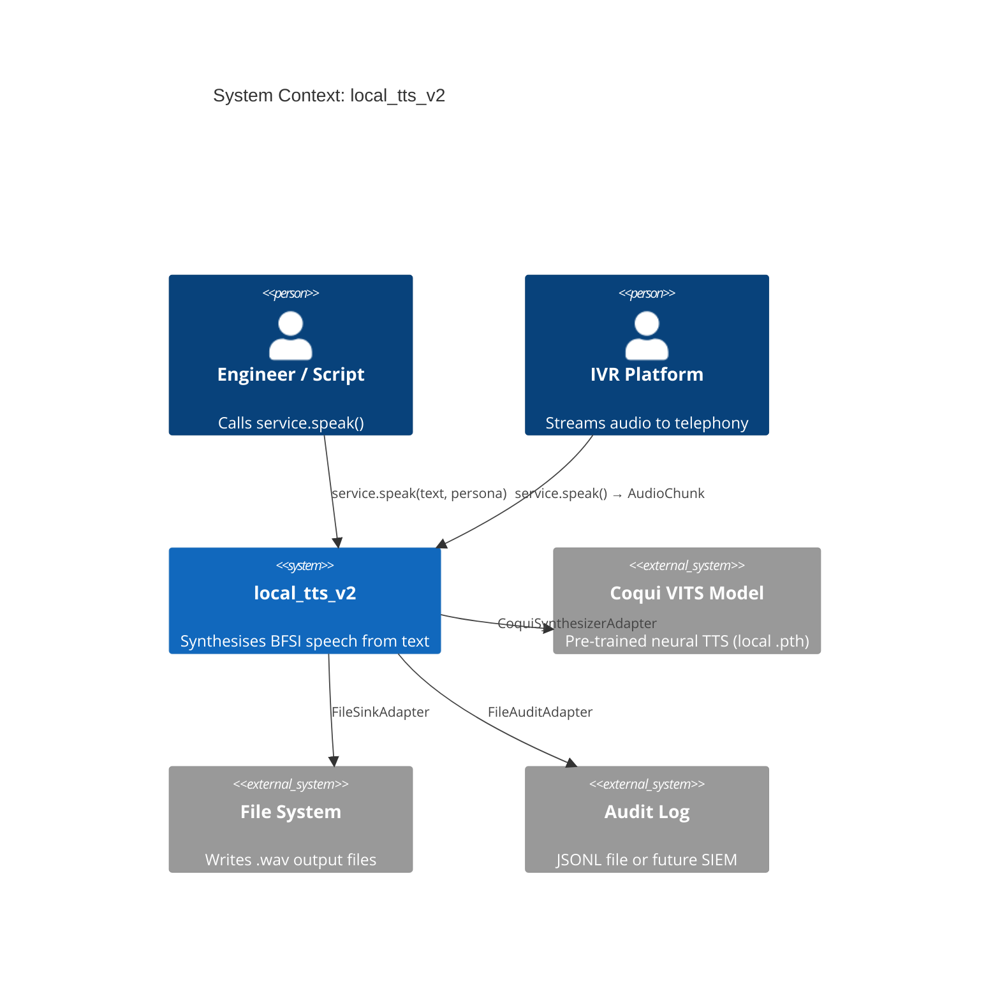
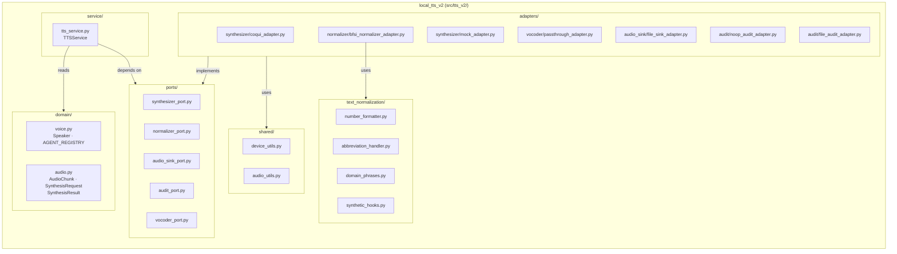
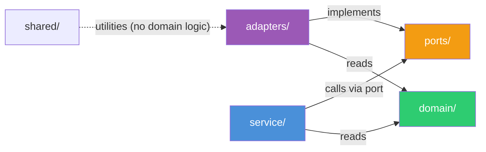
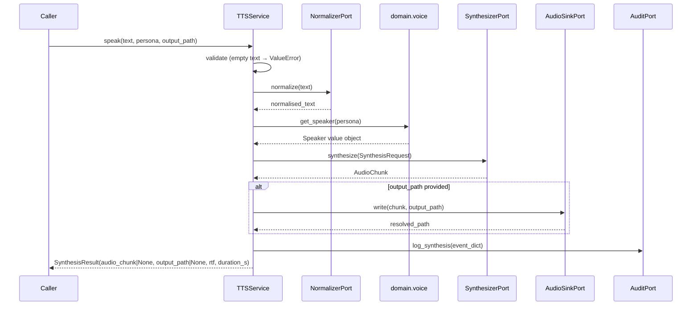

# Architecture Overview

`local_tts_v2` uses the **Hexagonal (Ports & Adapters)** pattern described by Alistair Cockburn (2005). The core idea: the business domain sits at the centre; all external dependencies (TTS models, file systems, audit sinks) attach at the perimeter via swappable adapters.

---

## C4 Level 1 — System Context

---

## C4 Level 2 — Container / Package Decomposition

---

## The Hexagonal Rule

!!! danger "The Rule — enforced in code via docstring"
    **`service/tts_service.py` must NEVER import from:**
    `torch`, `torchaudio`, `TTS`, `transformers`, `soundfile`, `num2words`,
    or any module inside `adapters/`.

    Imports allowed: `domain.*`, `ports.*`, `logging`, `typing`, stdlib only.

This rule means:

- You can run every unit test without a GPU, without model weights, and without `torch` installed.
- Swapping the TTS backend is a one-file change in `adapters/synthesizer/`.
- The service is trivially testable with `MockSynthesizerAdapter`.

---

## Dependency flow

**Arrows point inward only.** `domain/` has no imports from anywhere else in the package. `ports/` imports from `domain/` only. `service/` imports from `domain/` and `ports/`. `adapters/` import from `ports/`, `domain/`, and `shared/`.

---

## Call flow: `service.speak()`

