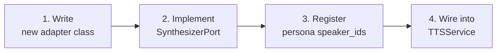

# Adding a TTS Adapter

This guide shows how to swap the TTS backend — for example, replacing Coqui with **F5-TTS** — by writing a single new file. The service layer and all tests remain untouched.

---

## The pattern in 4 steps



---

## Step 1 — Create the adapter file

Create `src/tts_v2/adapters/synthesizer/f5_adapter.py`:

```python
"""F5-TTS synthesizer adapter — implements SynthesizerPort."""

from __future__ import annotations

import logging
from typing import List

import numpy as np

from tts_v2.domain.audio import AudioChunk, SynthesisRequest
from tts_v2.domain.voice import get_speaker
from tts_v2.ports.synthesizer_port import SynthesizerPort  # type: ignore[misc]
from tts_v2.shared.device_utils import apply_transformers_shim, resolve_device

apply_transformers_shim()

logger = logging.getLogger(__name__)


class F5SynthesizerAdapter:
    """F5-TTS backend adapter.

    Implements SynthesizerPort via structural (duck-type) compatibility.

    Args:
        model_path: Path to F5-TTS checkpoint directory.
        use_gpu: Attempt GPU acceleration (MPS → CUDA → CPU).
    """

    def __init__(self, model_path: str, use_gpu: bool = True) -> None:
        from f5_tts import F5TTS  # lazy import — framework stays in adapter

        self.device = resolve_device(preferred=None, use_gpu=use_gpu)
        self._model = F5TTS(model_path, device=self.device)
        logger.info("F5SynthesizerAdapter ready on %s", self.device)

    def synthesize(self, request: SynthesisRequest) -> AudioChunk:
        """Synthesise speech from a normalised SynthesisRequest."""
        speaker = get_speaker(request.persona)
        wav, sr = self._model.tts(
            text=request.text,
            speaker_id=speaker.speaker_id,
        )
        return AudioChunk(
            samples=np.asarray(wav, dtype=np.float32),
            sample_rate=sr,
            speaker_id=speaker.speaker_id,
        )

    def get_speakers(self) -> List[str]:
        """Return list of available speaker IDs from F5-TTS."""
        return self._model.list_speakers()
```

!!! tip "Lazy imports"
    Always import the framework (`f5_tts`, `torch`, etc.) **inside** `__init__` or methods, never at module top-level. This keeps `from tts_v2.adapters.synthesizer.f5_adapter import F5SynthesizerAdapter` fast and importable in environments without the model installed.

---

## Step 2 — Verify the Protocol

The `SynthesizerPort` Protocol is `@runtime_checkable`. After writing your class, you can verify it satisfies the contract:

```python
from tts_v2.ports.synthesizer_port import SynthesizerPort
from tts_v2.adapters.synthesizer.f5_adapter import F5SynthesizerAdapter

assert isinstance(F5SynthesizerAdapter.__new__(F5SynthesizerAdapter), SynthesizerPort)
```

Or just run `pytest` — `TestTTSServiceWiring::test_service_initialises_without_error` will catch any missing methods.

---

## Step 3 — Update speaker IDs in the domain registry

F5-TTS uses different speaker IDs than Coqui VCTK. Update `src/tts_v2/domain/voice.py`:

```python
# Before (Coqui VCTK speaker IDs):
"professional_male": Speaker(persona="professional_male", speaker_id="p225", ...)

# After (F5-TTS speaker IDs):
"professional_male": Speaker(persona="professional_male", speaker_id="f5_speaker_02", ...)
```

The `persona` key and `TTSService` code are **unchanged**. Only `speaker_id` changes.

---

## Step 4 — Wire into TTSService

In your notebook or application entrypoint:

```python
from tts_v2.service.tts_service import TTSService
from tts_v2.adapters.synthesizer.f5_adapter import F5SynthesizerAdapter
from tts_v2.adapters.normalizer.bfsi_normalizer_adapter import BFSINormalizerAdapter
from tts_v2.adapters.audio_sink.file_sink_adapter import FileSinkAdapter
from tts_v2.adapters.audit.file_audit_adapter import FileAuditAdapter

service = TTSService(
    synthesizer=F5SynthesizerAdapter(model_path="models/f5-tts/", use_gpu=True),
    normalizer=BFSINormalizerAdapter(),
    audio_sink=FileSinkAdapter(),
    audit=FileAuditAdapter("logs/audit.jsonl"),
)
```

No other file needs to change.

---

## Step 5 — Write a smoke test

Add to `tests/test_tts_service.py` or a new `tests/test_f5_adapter.py`:

```python
import pytest
from tts_v2.adapters.synthesizer.f5_adapter import F5SynthesizerAdapter
from tts_v2.ports.synthesizer_port import SynthesizerPort

@pytest.mark.skipif(not F5_AVAILABLE, reason="F5-TTS not installed")
def test_f5_adapter_satisfies_port():
    """Structural check — no GPU needed."""
    # SynthesizerPort is runtime_checkable on method names only
    assert hasattr(F5SynthesizerAdapter, "synthesize")
    assert hasattr(F5SynthesizerAdapter, "get_speakers")
```

---

## Checklist

- [ ] New adapter file in `src/tts_v2/adapters/synthesizer/`
- [ ] Lazy framework import (inside `__init__`, not at module top)
- [ ] `synthesize()` returns `AudioChunk` with `float32` samples
- [ ] `get_speakers()` returns `List[str]`
- [ ] `speaker_id` values updated in `AGENT_REGISTRY` if backend changed
- [ ] Smoke test added
- [ ] `CHANGELOG.md` updated
- [ ] ADR written if this is a permanent backend swap
