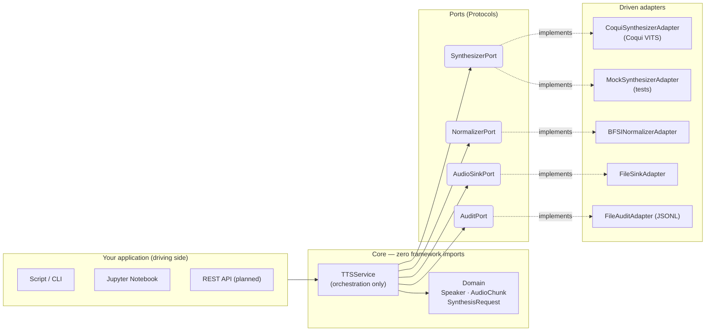

# local_tts_v2

**Production-grade BFSI Text-to-Speech pipeline** built on the **Hexagonal (Ports & Adapters)** architecture pattern.

---

## What is this?

`local_tts_v2` synthesises natural-language speech for Banking, Financial Services and Insurance (BFSI) contact-centre automation. It wraps multiple TTS backends (Coqui VITS today; F5-TTS and FishSpeech on the roadmap) behind stable Protocol interfaces so that **the business logic never changes when the underlying model changes**.

---

## Architecture at a glance

The core hexagonal rule: **nothing inside `service/` or `domain/` ever imports from `torch`, `TTS`, `soundfile`, or any adapter.** All framework code lives exclusively in `adapters/`.

---

## Key design decisions

| Principle | Implementation |
|-----------|----------------|
| **Dependency inversion** | `TTSService` depends on `Protocol` ports, never on concrete adapters |
| **Zero-GPU tests** | `MockSynthesizerAdapter` returns silence — 20 tests in 0.07 s |
| **Replaceability** | Swap Coqui → FishSpeech by writing ~40 lines in one adapter file |
| **BFSI compliance** | Every synthesis event logged via `AuditPort`; JSONL records are DPDPA-compatible |
| **Text normalisation** | Pluggable `NormalizerPort` handles OTP masking, amounts, abbreviations in chain |
| **MPS support** | `resolve_device()` prefers Apple Silicon MPS → CUDA → CPU automatically |

---

## Quick links

-   :material-rocket-launch:{ .lg .middle } **Getting Started**

    ---
    Install, wire the service, and synthesise your first utterance.

    [:octicons-arrow-right-24: Getting Started](getting-started.md)

-   :material-hexagon-multiple:{ .lg .middle } **Architecture**

    ---
    C4 diagrams, layer responsibilities, and the hexagonal dependency rule.

    [:octicons-arrow-right-24: Architecture Overview](architecture/overview.md)

-   :material-puzzle:{ .lg .middle } **Adding an Adapter**

    ---
    Swap the TTS backend in ~40 lines. Step-by-step guide.

    [:octicons-arrow-right-24: Adding a TTS Adapter](guides/adding-a-tts-adapter.md)

-   :material-handshake:{ .lg .middle } **Knowledge Transfer**

    ---
    Day 1 onboarding guide and ownership transfer checklist.

    [:octicons-arrow-right-24: Onboarding](kt/onboarding.md)

